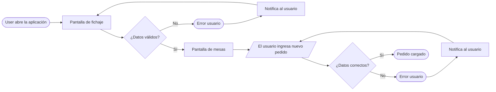
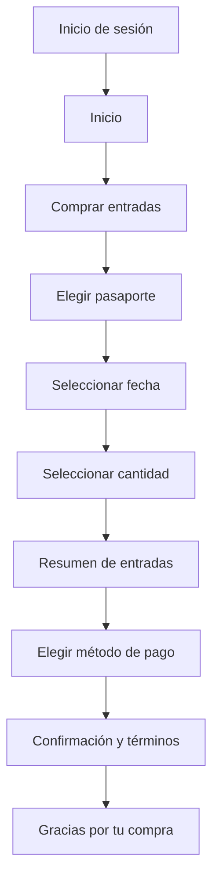

# Flows

> Material de 2026 sobre diagramas de flujo para experiencia de usuario.

## ¿Qué es un flow?

Un **flow** es la representación visual del recorrido que hace un usuario para completar una tarea. Muestra los pasos, las decisiones y las pantallas de principio a fin.

## ¿Para qué sirven?

Diseñar el flow **antes** que la interfaz evita rehacer pantallas. Primero se resuelve la lógica del recorrido y después el diseño visual. Un buen flow detecta pasos innecesarios, callejones sin salida y decisiones mal ubicadas.

## Los 3 tipos de flow

| Tipo | Descripción |
| --- | --- |
| **Task flow** | Un solo camino lineal para completar **una** tarea; no tiene ramas ni decisiones. |
| **User flow** | Recorrido con decisiones y ramas. Contempla distintos caminos posibles del usuario. |
| **Wireflow** | User flow + wireframes. Muestra el flujo y cómo se ve cada pantalla. |

---

## Task flow

Un camino lineal con un solo objetivo: entregar un TP. Sin decisiones.

```mermaid
flowchart LR
    A([User abre la aplicación]) --> B[El usuario inicia sesión]
    B --> C[Abre el menú]
    C --> D[Selecciona “comprar pasaportes”]
    D --> E[Selecciona “parque de la costa”]
    E --> F[Selecciona “pasaporte full”]
    F --> G[Selecciona la fecha: 4 de abril de 2026]
    G --> H[Indica que son 3 pasaportes]
    H --> I[Aprieta el botón “continuar”]
    I --> J[El usuario selecciona su tarjeta guardada]
    J --> K[El usuario acepta los términos y condiciones]
    K --> L([El usuario aprieta el botón “comprar”])
```

---

## User flow

Tiene el mismo objetivo, pero incorpora decisiones.

### Convenciones del diagrama

| Forma | Significado |
| --- | --- |
| Rectángulo de puntas redondas | Inicio o fin de la tarea. |
| Rectángulo | Pantalla o sección en la que se encuentra el usuario. |
| Paralelogramo | Acción realizada por el usuario dentro de la interfaz. |
| Rombo | Decisión, normalmente con respuesta positiva o negativa, que divide el camino. |
| Círculo | Error cometido por el usuario. |

---

## Wireflow

El mismo recorrido, pero cada paso muestra **cómo se ve la pantalla**.

### Ejemplo: compra de entradas

1. Inicio de sesión: campos de mail y clave, y botón **Aceptar**.
2. Inicio: menú principal con la opción **Comprar entradas**.
3. Comprar entradas: selección de **Pasaporte Full - Pura Adrenalina**.
4. Detalles de la compra, paso 1 de 4: selección de fecha (abril).
5. Detalles de la compra, paso 2 de 4: selección de cantidad de entradas.
6. Detalles de la compra, paso 2 de 4: resumen de entradas y botón **Continuar**.
7. Detalles del pago, paso 3 de 4: elección de tarjeta guardada o agregar una nueva tarjeta.
8. Confirmación, paso 4 de 4: resumen de entradas, pago y compra; aceptación de términos y condiciones; botón **Comprar**.
9. Pantalla final: **Gracias por tu compra**, con las opciones **Ver entradas** e **Ir al inicio**.

---

