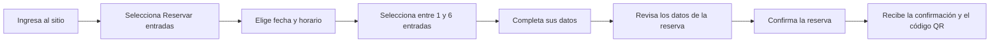

# Task flow — Reserva de entradas

## Objetivo

El task flow representa el recorrido ideal para completar la reserva. Por esta razón, muestra una única secuencia de acciones y no incluye errores, decisiones alternativas ni situaciones excepcionales. Estos casos se desarrollarán posteriormente en el user flow.

## Condiciones de la reserva

- El evento es gratuito.
- Se pueden reservar entre 1 y 6 entradas.
- La persona no necesita realizar un pago.
- Luego de confirmar la reserva, recibe una confirmación y un código QR para presentar al ingresar al evento.
- El pasaporte del recorrido es físico y se entrega durante la acreditación presencial.
- Las tres estaciones del evento deben realizarse en el orden establecido.

## Recorrido principal

1. La persona ingresa al sitio web de FAIR PLAY.
2. Selecciona la opción **“Reservar entradas”**.
3. Elige una fecha y un horario disponibles.
4. Selecciona entre 1 y 6 entradas.
5. Completa sus datos personales y, si corresponde, informa sus necesidades de accesibilidad.
6. Revisa la fecha, el horario, la cantidad de entradas y los datos ingresados.
7. Confirma la reserva.
8. Recibe la confirmación y el código QR.

## Diagrama

## Información posterior a la reserva

La pantalla de confirmación debe explicar que la persona tendrá que presentar el código QR al ingresar al evento. Durante la acreditación recibirá el pasaporte físico, que deberá completar recorriendo las tres estaciones en el orden indicado.

El pasaporte y las estaciones no forman parte de este task flow porque corresponden a la experiencia presencial y ocurren después de finalizar la reserva.
