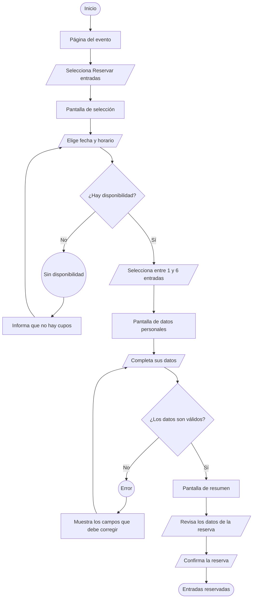

# User flow — Reserva de entradas

## Objetivo

Representar los distintos caminos que puede recorrer una persona para reservar entradas gratuitas para el evento FAIR PLAY desde el sitio web. A diferencia del task flow, este diagrama incorpora decisiones, errores y caminos de recuperación.

El recorrido no exige crear una cuenta ni iniciar sesión. La persona realiza la reserva como invitada y solo completa los datos necesarios para recibir la confirmación.

## Condiciones

- La reserva es gratuita.
- Se pueden solicitar entre 1 y 6 entradas.
- La cantidad disponible depende del cupo de la fecha y el horario elegidos.
- Si no hay disponibilidad, la persona puede elegir otra fecha u otro horario.
- Si los datos ingresados no son válidos, el sistema indica qué campos deben corregirse.
- Al finalizar, la persona recibe la confirmación y el código QR de la reserva.
- El pasaporte físico se entrega durante la acreditación en el evento.
- Las tres estaciones presenciales deben realizarse en el orden establecido.

## Recorrido

1. La persona ingresa a la página del evento.
2. Selecciona la opción **“Reservar entradas”**.
3. Accede a la pantalla de selección y elige una fecha y un horario.
4. El sistema comprueba si hay disponibilidad:
   - Si no hay cupos, informa la situación y permite elegir otra fecha u horario.
   - Si hay cupos, permite continuar con la reserva.
5. La persona selecciona entre 1 y 6 entradas.
6. Accede a la pantalla de datos personales y completa el formulario.
7. El sistema valida la información:
   - Si los datos no son válidos, señala los campos que deben corregirse y regresa al formulario.
   - Si los datos son válidos, muestra el resumen de la reserva.
8. La persona revisa la fecha, el horario, la cantidad de entradas y sus datos personales.
9. Confirma la reserva.
10. El sistema informa que las entradas fueron reservadas y entrega el código QR.

## Diagrama

## Convenciones utilizadas

| Forma | Significado |
| --- | --- |
| Rectángulo de puntas redondeadas | Inicio o final de la tarea. |
| Rectángulo | Pantalla o sección del sitio. |
| Paralelogramo | Acción realizada por la persona. |
| Rombo | Decisión que divide el recorrido. |
| Círculo | Error o situación que impide continuar temporalmente. |

## Pantalla final

Además de confirmar la reserva y mostrar el código QR, la pantalla final debe informar que el QR se presenta al ingresar, que el pasaporte físico se entrega durante la acreditación y que las tres estaciones deben completarse en el orden indicado.

El recorrido presencial no forma parte de este user flow porque comienza después de finalizar la reserva.
